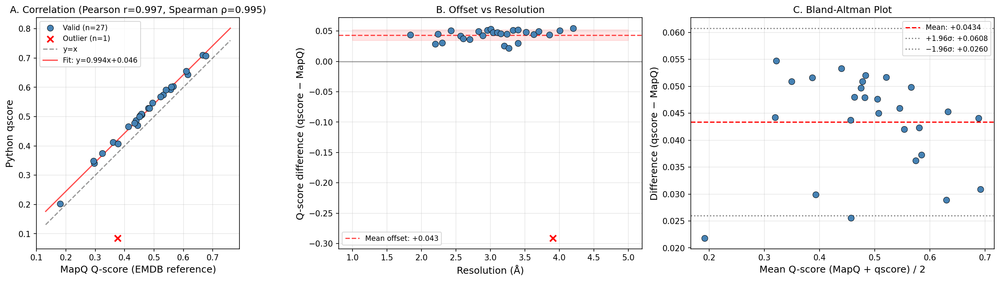

<div align="center">

# Q-score Validation

**Benchmarking pure Python Q-score computation against MapQ/Chimera (EMDB reference)**

[](https://www.python.org/downloads/)
[](LICENSE)
[](https://github.com/salilab/IHMValidation/issues/119)

</div>

---

## Overview

This repository contains a systematic comparison of the **pure Python Q-score reimplementation** ([jamaliki/qscore](https://github.com/jamaliki/qscore)) against the **reference MapQ/Chimera implementation** ([gregdp/mapq](https://github.com/gregdp/mapq)), as used by the [EMDB](https://www.ebi.ac.uk/emdb/) for structural validation reports.

This work supports the effort to **remove the UCSF Chimera dependency** from the [IHMValidation](https://github.com/salilab/IHMValidation) pipeline ([issue #119](https://github.com/salilab/IHMValidation/issues/119)).

### What is Q-score?

The Q-score metric quantifies the **resolvability of individual atoms** in cryo-EM maps by measuring the similarity between the map values around each atom and a reference Gaussian profile. A Q-score of **1.0** indicates perfect resolvability, while values closer to **0.0** indicate poor resolvability. It was introduced by [Pintilie et al. (2020)](#references) and is now part of the standard wwPDB/EMDB validation pipeline.

### Why replace MapQ?

The current implementation relies on **MapQ**, a UCSF Chimera plugin, which introduces several issues:

| Issue | Impact |
|-------|--------|
| Requires UCSF Chimera (Python 2.7) | Heavy, legacy dependency |
| Needs Tk and X11 display libraries | Fails in headless environments |
| Slow for large structures | Minutes per structure |
| Not pip-installable | Manual installation required |

---

## Method

1. Selected **28 EMDB entries** with deposited Q-scores (resolution: 1.8–4.2 Å)
2. Downloaded PDB models and EMDB maps for each entry
3. Computed Q-scores using `jamaliki/qscore` with `σ = 0.4` (EMDB standard)
4. Compared against EMDB reference Q-scores (computed by MapQ v2.9.7)

---

## Results

### Correlation Plot

<div align="center">



**Figure 1.** (A) Scatter plot of MapQ vs qscore values with linear fit. (B) Difference as a function of resolution. (C) Bland-Altman plot showing limits of agreement. The red × marks the single outlier (EMD-72359, extremely low map contrast).

</div>

### Summary Statistics

| Metric | All entries (n=28) | Excluding outlier (n=27) |
|--------|:------------------:|:------------------------:|
| **Pearson r** | 0.892 | **0.997** |
| **Spearman ρ** | 0.987 | **0.995** |
| **Mean offset** | +0.031 ± 0.063 | **+0.043 ± 0.009** |
| **Max \|diff\|** | 0.291 | **0.055** |
| **Linear fit** | — | qscore = 0.994 × MapQ + 0.046 |

### Full Comparison Table

<details>
<summary>Click to expand (28 entries)</summary>

| EMDB ID | PDB ID | Res (Å) | MapQ | qscore | Diff | % Diff |
|---------|--------|:-------:|:----:|:------:|:----:|:------:|
| EMD-52518 | 9HYU | 1.8 | 0.666 | 0.710 | +0.044 | +6.6% |
| EMD-2984 | 5A1A | 2.2 | 0.615 | 0.644 | +0.029 | +4.7% |
| EMD-53512 | 9R1Q | 2.2 | 0.610 | 0.655 | +0.045 | +7.4% |
| EMD-64933 | 9VBT | 2.3 | 0.676 | 0.707 | +0.031 | +4.6% |
| EMD-64047 | 9UCL | 2.4 | 0.452 | 0.503 | +0.051 | +11.3% |
| EMD-48779 | 9N09 | 2.6 | 0.532 | 0.574 | +0.042 | +7.9% |
| EMD-55737 | 9T9U | 2.6 | 0.566 | 0.603 | +0.037 | +6.6% |
| EMD-73900 | 9Z8M | 2.7 | 0.556 | 0.592 | +0.036 | +6.5% |
| EMD-63009 | 9LDX | 2.8 | 0.541 | 0.591 | +0.050 | +9.2% |
| EMD-55355 | 9SYV | 2.9 | 0.559 | 0.601 | +0.042 | +7.6% |
| EMD-54930 | 9SIQ | 3.0 | 0.495 | 0.547 | +0.052 | +10.4% |
| EMD-66260 | 9WUF | 3.0 | 0.413 | 0.466 | +0.053 | +12.9% |
| EMD-53804 | 9R85 | 3.0 | 0.458 | 0.506 | +0.048 | +10.5% |
| EMD-53483 | 9R0I | 3.1 | 0.481 | 0.529 | +0.048 | +9.9% |
| EMD-60928 | 9IVJ | 3.1 | 0.522 | 0.568 | +0.046 | +8.8% |
| EMD-56518 | 9U2S | 3.2 | 0.444 | 0.470 | +0.026 | +5.8% |
| EMD-47792 | 9E9D | 3.2 | 0.484 | 0.529 | +0.045 | +9.3% |
| EMD-55831 | 9TEO | 3.3 | 0.181 | 0.203 | +0.022 | +12.0% |
| EMD-63013 | 9LE2 | 3.3 | 0.361 | 0.413 | +0.052 | +14.3% |
| EMD-66788 | 9XED | 3.4 | 0.378 | 0.408 | +0.030 | +7.9% |
| EMD-3061 | 5A63 | 3.4 | 0.457 | 0.509 | +0.052 | +11.4% |
| EMD-56096 | 9TNZ | 3.5 | 0.439 | 0.487 | +0.048 | +10.9% |
| EMD-48340 | 9MKW | 3.6 | 0.297 | 0.341 | +0.044 | +14.9% |
| EMD-49797 | 9NU5 | 3.7 | 0.450 | 0.500 | +0.050 | +11.0% |
| EMD-54674 | 9S98 | 3.9 | 0.434 | 0.478 | +0.044 | +10.1% |
| EMD-72359 | 9XZK\* | 3.9 | 0.376 | 0.085 | −0.291 | −77.4% |
| EMD-71406 | 9P9C | 4.0 | 0.324 | 0.375 | +0.051 | +15.7% |
| EMD-53590 | 9R5K | 4.2 | 0.294 | 0.349 | +0.055 | +18.6% |

\* **Outlier** — extremely low map contrast (σ ≈ 100× below normal).

</details>

---

## Root Cause Analysis

### Source of the systematic offset (+0.043)

The offset arises from a **fundamental algorithmic difference**:

| | MapQ (reference) | qscore (pure Python) |
|---|---|---|
| **Approach** | Volume-based cross-correlation | Point-based radial sampling |
| **Implementation** | 3D Gaussian grid via `_gaussian.sum_of_gaussians` → CCm via `FitMap.overlap_and_correlation` | Random points on spherical shells (0–2.0 Å) → Pearson correlation of radial profiles |
| **Dependency** | UCSF Chimera | NumPy, SciPy |

### Factors ruled out

| Factor | Effect on offset | Method |
|--------|:----------------:|--------|
| Reference Gaussian parameters | None | Both use identical formula: `maxD = min(mean + 10σ, max)` |
| Number of sampling points (8 → 64) | < 0.001 | Tested on EMD-2984/5A1A |
| Random seed variation | < 0.001 | Three independent runs |

### Outlier (EMD-72359/9XZK)

| Property | Normal maps | EMD-72359 |
|----------|:----------:|:---------:|
| Map σ | 0.01–0.05 | **0.0002** |
| height/max ratio | 0.2–1.0 | **0.12** |

The extremely low contrast causes the reference Gaussian to become poorly conditioned.

### Speed comparison

| Implementation | Time (5A1A, 32k atoms) | Dependencies |
|---------------|:----------------------:|:------------:|
| MapQ/Chimera | Minutes | UCSF Chimera, Tk, X11 |
| **jamaliki/qscore** | **~11 seconds** | NumPy, SciPy, BioPython, mrcfile |

---

## Integration

The integration code for IHMValidation is available on a separate branch:

**Branch:** [`ShravyaRS/IHMValidation:qscore-pure-python`](https://github.com/ShravyaRS/IHMValidation/tree/qscore-pure-python)

### Changes

| File | Description |
|------|-------------|
| `ihm_validation/qscore_utils.py` | New module: pure Python Q-score computation matching VA's output format |
| `ihm_validation/em.py` | Removed `qscore` from VA CLI call; computes Q-scores directly; backward compatible |
| `pyproject.toml` | Added `qscore` as optional dependency (`[em]`, `[all]`) |

### Required fix for jamaliki/qscore
```python
# qscore/utils.py — interpolate_grid_at_points()
# Add bounds_error=False to handle atoms near map edges
return interpn((x, y, z), map.grid, p, bounds_error=False, fill_value=0.0)
```

---

## Repository Structure
```
qscore_validation/
├── LICENSE
├── README.md
├── scripts/
│   ├── run_qscore_comparison.py   # Download, compute, and compare Q-scores
│   └── analyze_results.py         # Statistical analysis and plotting
├── results/
│   ├── qscore_comparison_full.csv # All 28 entries with Q-scores
│   └── qscore_correlation.png     # Three-panel figure
└── test_data/                     # Downloaded on demand (not committed)
```

---

## Reproducing
```bash
# Clone this repo
git clone https://github.com/ShravyaRS/qscore-validation.git
cd qscore-validation

# Install dependencies
pip install mrcfile biopython scipy tqdm matplotlib

# Install qscore and apply fix
pip install git+https://github.com/jamaliki/qscore.git
QPATH=$(python -c "import qscore; print(qscore.__path__[0])")
sed -i 's/return interpn((x, y, z), map.grid, p)/return interpn((x, y, z), map.grid, p, bounds_error=False, fill_value=0.0)/' $QPATH/utils.py

# Run full comparison (~2 GB of map downloads)
python scripts/run_qscore_comparison.py

# Analyze results and generate plots
python scripts/analyze_results.py
```

---

## References

1. Pintilie, G., Zhang, K., Su, Z. et al. (2020). Measurement of atom resolvability in cryo-EM maps with Q-scores. *Nature Methods* **17**, 328–334. [doi:10.1038/s41592-020-0731-1](https://doi.org/10.1038/s41592-020-0731-1)

2. Pintilie, G. et al. (2025). Q-score as a reliability measure for protein, nucleic acid, and small molecule atomic coordinate models derived from 3DEM density maps. *Acta Cryst.* **D81**. [doi:10.1107/S2059798325005923](https://doi.org/10.1107/S2059798325005923)

3. Lawson, C.L. et al. (2021). Cryo-EM model validation recommendations based on outcomes of the 2019 EMDataResource challenge. *Nature Methods* **18**, 156–164. [doi:10.1038/s41592-020-01051-w](https://doi.org/10.1038/s41592-020-01051-w)

4. MapQ — Chimera plugin for Q-scores: [github.com/gregdp/mapq](https://github.com/gregdp/mapq)

5. jamaliki/qscore — Pure Python reimplementation: [github.com/jamaliki/qscore](https://github.com/jamaliki/qscore)

---

<div align="center">

*Part of the [IHMValidation](https://github.com/salilab/IHMValidation) project at [Sali Lab](https://salilab.org/)*

</div>
